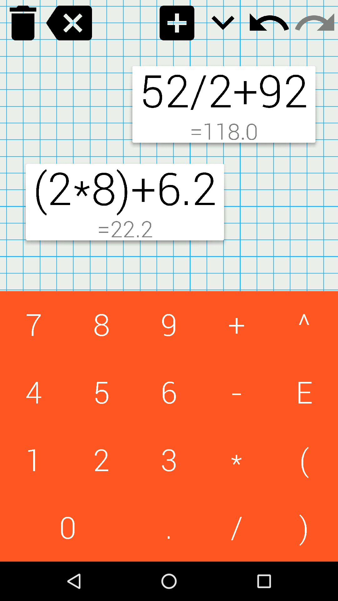

# Gesture based calculator

Take full advantage of your touch screen using touch-optimized gestures to perform calculations with unprecedented ease and speed.

GESTURES:
- Swipe and move.
- Pinch to zoom.
- Drag to rearrange.
- Draw a circle to add parenthesis.

Features:
- Use blocks to build expressions.
- Move numbers to the trashcan to delete.
- Tap the trashcan to delete everything.
- Includes undo and redo functionality.
- Hide the keypad for extra space.

